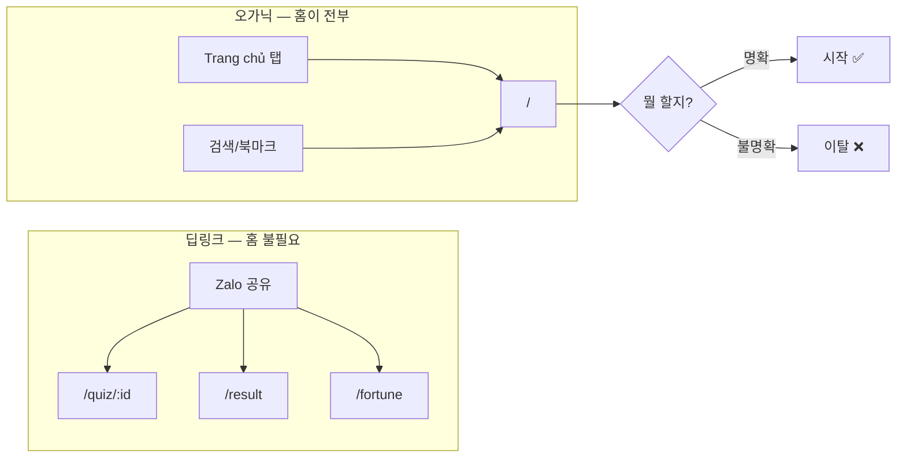
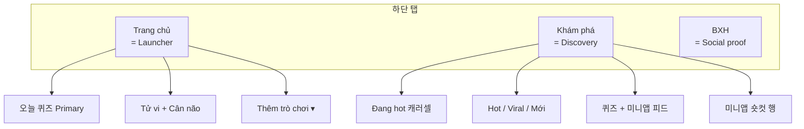

# 홈 IA 기획서 — Launcher Model v1.0

> **상태:** 기획 (구현 전)  
> **관계:** `vn_mz_pipeline_v52.plan.md`(AI·운세 파이프라인)과 **별도**. v5.2 Phase 4(hint)는 이 기획의 **임시 완화**였으며, 근본 IA 문제는 미해결.  
> **목표:** 처음 들어온 VN Gen Z가 **3초 안에** “이게 뭐고, 지금 뭘 누르면 되는지” 이해하고 **90초 안에** 한 가지를 끝낸다.

---

## 0. Executive Summary

| 항목 | 내용 |
|------|------|
| **문제** | 홈(`/`)이 **시작 화면**이 아니라 **허브 + 캐러셀 + 피드**가 겹친 탐색 페이지라, 신규·재방문 모두 “뭘 해야 하지?”에서 멈춘다. |
| **방향** | 홈 = **Launcher**(오늘 하나 고르기). 탐색 = **Khám phá** 탭 전담. |
| **핵심 변경** | 첫 뷰포트 **선택지 3~4개**, 퀴즈 **Primary 1개**, 미니앱 **2차(접기)**, 피드·캐러셀 **홈에서 제거**. |
| **성공 기준** | 홈 → 퀴즈/미니앱 **시작 CTR ↑**, 홈 체류 **↓**(빨리 나가는 게 정상), Khám phá 탭 **이탈 ↓**. |

---

## 1. 배경 — 왜 지금인가

### 1.1 제품 성장과 IA 불일치

nambac은 **퀴즈 단일 앱**에서 **퀴즈 + 6+ 미니앱 허브**로 커졌다.

| 시기 | 홈의 역할 | 실제 코드 반영 |
|------|-----------|----------------|
| 초기 | 오늘의 퀴즈 시작 | `pickDailyQuiz` + CTA |
| 확장 | 운세·밸런스·로스트·브레인 | `home-today-grid` 카드 추가 |
| 확장 | Liên Quân·VBTI | 그리드 + 사이드바 `Chơi nhanh` |
| 성장 | 바이럴·탐색 | `hero-carousel` + `home-feed-section` (Hot/Viral/Mới) |

**IA는 “퀴즈 앱 홈”으로 남아 있고, UI는 “슈퍼앱 첫 화면”처럼 보인다.**  
hint 한 줄 추가(v5.2)로는 **정보 계층**이 바뀌지 않아 이해 문제가 남는다.

### 1.2 유입 경로와 홈의 책임



- **딥링크 유입(~70% 가정):** 홈 품질과 무관하게 전환 가능 → 이미 잘 됨.
- **오가닉·재방문:** 홈이 **제품 정의 + 다음 행동**을 담당해야 함 → **현재 실패 지점**.

### 1.3 MZ 피드백과의 연결

| MZ 신호 | 파이프라인 v5.2 대응 | 홈 IA 필요 |
|---------|---------------------|------------|
| 글 많음 | 퀴즈 결과 길이·VI | 홈 카드/피드 **밀도** |
| 지루함 | Tier A 카테고리 | 홈 **선택지 수** |
| 운세 부족 | 4축·DOB·zodiac | Tử vi **노출 위치** |
| “뭐 하는 앱?” | (미대응) | **1줄 정의** + 계층 |

---

## 2. 제품 원칙 (Home 전용)

1. **One screen, one job** — 홈 한 화면 = “오늘 뭐 할지 고르기”만.
2. **Primary는 하나** — 퀴즈가 브랜드 코어; 나머지는 Secondary/Tertiary.
3. **탐색은 탭으로** — 피드·정렬·캐러셀은 Khám phá 소유.
4. **3초 규칙** — 스크롤 없이: 무엇 / 왜 / 뭘 누를지.
5. **90초 규칙** — 고른 뒤 90초 안에 결과·공유까지 갈 수 있어야 함 (기존 플로우 유지).
6. **VI 톤** — 카피는 짧은 베트남어; 영어 라벨(Hot/Viral)은 피드 탭으로 격리.

---

## 3. 사용자 & Jobs-to-be-done

### 3.1 페르소나 (우선순위)

| ID | 누구 | 상황 | JTBD |
|----|------|------|------|
| **P1** | VN Gen Z, 카페 | 친구랑 폰 넘기며 “뭐 해볼까” | **빨리 하나 골라 재밌게 끝내고 Zalo에 올리기** |
| **P2** | 재방문 유저 | 스트릭·등급 챙기러 옴 | **오늘 미션(퀴즈/운세) 1개 바로 시작** |
| **P3** | 퀴즈만 찾는 유저 | 제목/카테고리 보고 싶음 | **많은 퀴즈 둘러보기** → Khám phá |
| **P4** | 미니앱 팬 | LQ/VBTI만 씀 | **바로 해당 앱 진입** → 2차 메뉴 또는 Khám phá |

**홈 최적화 대상: P1 > P2.** P3·P4는 홈이 아니라 Khám phá·드로어가 받는다.

### 3.2 인지 부하 분석 (현재)

| 요소 | 개수 | 사용자 질문 | 부하 |
|------|------|-------------|------|
| Today 카드 | 6 | “다 똑같이 중요한가?” | 높음 |
| CTA 중복 | Quiz 버튼 + 카드, VBTI 2곳 | “어느 게 맞지?” | 높음 |
| 캐러셀 슬라이드 | ~6 | “위랑 아래 뭐가 다르지?” | 중간 |
| 정렬 탭 | 3 | “Hot이랑 Viral 차이?” | 중간 |
| 피드 카드 | 10+ | “홈이 끝인가, 시작인가?” | 높음 |
| 사이트 정의 | 0 (푸터만) | “nambac이 뭐야?” | **치명** |

**첫 뷰포트 인지 부하 추정: 12+ 결정점** → 권장 **≤4**.

---

## 4. 현황 감사 (As-is)

### 4.1 홈 섹션 스택 (`Home.jsx`)

| 순서 | 섹션 | 역할 | 문제 |
|------|------|------|------|
| 1 | `home-today` | 오늘 허브 | 카드 6 + CTA 2 + Não 링크 — **과밀** |
| 2 | `AdSenseUnit` | 광고 | OK (오늘·피드 사이) |
| 3 | `home-hot-section` | Đang hot 캐러셀 | **탐색 기능이 홈에 있음** |
| 4 | `home-feed-section` | Hot/Viral/Mới + 그리드 | **Explore와 중복** |
| 5 | `home-brand-cta` | B2B | 신규 유저 노이즈 |

### 4.2 탭 역할 중복

| 탭 | 현재 콘텐츠 | 홈과 겹침 |
|----|-------------|-----------|
| Trang chủ `/` | 허브 + 캐러셀 + 피드 + B2B | — |
| Khám phá `/explore` | Viral 정렬 퀴즈 그리드만 | 홈 피드와 **80% 중복** |
| BXH `/leaderboard` | 랭킹 리스트 | 홈 Viral 탭과 유사 |

### 4.3 네비게이션 이중 구조

- **하단 탭:** Trang chủ / Khám phá / BXH
- **사이드바:** Quiz hôm nay / Tử vi / Chơi nhanh(5링크) / 카테고리

→ 홈 카드 6개와 드로어 링크가 **거의 동일**. 홈이 길어질 이유가 없음.

---

## 5. 목표 IA (To-be) — 3-Tab Model



### 5.1 탭별 한 줄 정의 (사용자-facing)

| 탭 | 베트남어 카피 | 한국어 의도 |
|----|---------------|-------------|
| Trang chủ | *Hôm nay chơi gì?* | 오늘 뭐 할지 **고르고 시작** |
| Khám phá | *Xem thêm quiz & trò chơi* | **더 둘러보기** |
| BXH | *Ai share nhiều nhất* | **자랑·랭킹** (변경 최소) |

---

## 6. 홈 Launcher 상세 스펙 (Phase A 핵심)

### 6.1 첫 뷰포트 와이어 (목표)

```text
┌──────────────────────────────────┐
│ ☰  NamBắc              🔥 🌱    │  SiteLogoBar (기존)
├──────────────────────────────────┤
│  Quiz AI · 5 câu · share Zalo    │  ← NEW: site-pitch (1줄)
│  Hôm nay chơi gì? · ~90 giây ☕  │  ← title 개선
├──────────────────────────────────┤
│ ┌──────────────────────────────┐ │
│ │  [오늘 퀴즈 썸네일 — wide]    │ │  ← NEW: hero-quiz (Primary)
│ │  {todayQuiz.title truncated}  │ │
│ │  ▶ Bắt đầu ngay               │ │  ← 유일한 filled CTA
│ └──────────────────────────────┘ │
├──────────────────────────────────┤
│  [ Tử vi ]      [ Cân não ]      │  ← Secondary 2-up (hint 유지)
├──────────────────────────────────┤
│  Thêm trò chơi ▾                 │  ← Tertiary accordion
│    Bóc phốt · Não bạn · LQ · VBTI│
├──────────────────────────────────┤
│  Khám phá thêm →                 │  ← text link → /explore
└──────────────────────────────────┘
     (스크롤 전 끝 — 이상적)
```

### 6.2 정보 계층 (Tier)

| Tier | 항목 | 개수 | UI 처리 |
|------|------|------|---------|
| **T0** | 사이트 1줄 정의 | 1 | `home-pitch` |
| **T1** | 오늘 퀴즈 | 1 | wide hero + CTA |
| **T2** | Tử vi, Cân não | 2 | 기존 `TodayThumbCard` 2열, 썸네일 유지 |
| **T3** | Bóc phốt, Não, LQ, VBTI | 4 | **접힌 패널** 기본 닫힘 |
| — | Khám phá 링크 | 1 | `/explore` 유도 |

### 6.3 제거·이동 (홈에서)

| 요소 | 처리 |
|------|------|
| 6카드 그리드 (퀴즈·LQ·VBTI 포함) | T1~T3 구조로 **재배치** |
| `home-today-vbti-cta` (하단 VBTI 버튼) | **삭제** (T3로 통합) |
| `home-today-start-cta` + 퀴즈 카드 | **hero-quiz 하나로 통합** |
| `home-hot-section` 캐러셀 | → **Explore Phase B** |
| `home-feed-section` | → **Explore Phase B** |
| `home-brand-cta` | → **푸터 링크만** 또는 Explore 하단 |
| `Não bạn` 단독 링크 | → T3 패널 안 |

### 6.4 카피 시스템 (VI)

| 위치 | 문구 (안) | 역할 |
|------|-----------|------|
| `home-pitch` | `Quiz AI · 5 câu · khoe Zalo ngay` | 제품 정의 |
| `home-today-title` | `Hôm nay chơi gì?` | 행동 질문 |
| `home-today-sub` | `~90 giây là xong — ở quán cf cũng được ☕` | 시간·상황 |
| Primary CTA | `▶ Bắt đầu ngay` | 단일 강조 |
| T2 hint | (기존 유지) `Tên + ngày sinh`, `Chọn A hay B` | 기능 설명 |
| T3 toggle | `Thêm trò chơi` / `Thu gọn` | 확장 |
| Explore link | `Khám phá thêm quiz →` | 탭 유도 |

**금지:** 첫 뷰포트에 Hot/Viral/Mới 영어 탭, B2B 문단, FAQ 버튼 묶음.

### 6.5 완료 상태 (doneToday)

- 기존 `readTodayDone()` 체크마크 **유지**.
- T1 hero에도 `is-done` 표시.
- T3는 done 표시만 (카드 축소).

### 6.6 접근성·모바일

- Primary CTA **최소 높이 48px**.
- T3 accordion: `aria-expanded`, 키보드 토글.
- 첫 뷰포트 **~640px 이내** (iPhone SE 기준 스크롤 없음 목표).

---

## 7. Khám phá 탭 고도화 (Phase B)

현재 `/explore`는 Viral 정렬 퀴즈 그리드만 있음 → 홈에서 내린 기능 **흡수**.

### 7.1 Explore 목표 구조

```text
Khám phá
├── Đang hot (캐러셀)        ← home에서 이전
├── Mini-apps (가로 스크롤)  ← Tử vi / Cân não / Bóc phốt / …
├── Sắp xếp: Hot | Viral | Mới
└── Grid (퀴즈 + feature 피드) ← buildHomeFeed 재사용
```

### 7.2 홈과 차별화

| | 홈 | Khám phá |
|--|-----|----------|
| 질문 | “오늘 뭐 하지?” | “또 뭐 있지?” |
| 선택지 | ≤4 (접기 전) | 무제한 스크롤 |
| 정렬 | 없음 | Hot/Viral/Mới |
| 미니앱 | 2개 + 접기 | 전체 노출 |

### 7.3 구현 메모

- `buildFeatureFeedItems` + `buildHomeFeed` → Explore로 이동 또는 공유 hook.
- `pickHeroSlides` → Explore 전용.
- Explore Helmet description 갱신.

---

## 8. 사이드바·푸터 역할 정리

| 영역 | 역할 (변경 후) |
|------|----------------|
| **SidebarDrawer** | 파워유저·전체 목록 (카테고리·미니앱). 홈과 **중복 OK** — “메뉴판” |
| **Footer SiteIntroBox** | 신뢰·정책·FAQ. **첫 방문 보조** (홈 pitch가 1차) |
| **BottomNav** | 3탭 IA의 뼈대 — **카피만** 필요 시 미세 조정 |

---

## 9. 단계별 로드맵

### Phase A — 홈 Launcher (P0, 1~2일)

**범위:** `Home.jsx` + `Home.css` only.

| # | 작업 | 완료 기준 |
|---|------|-----------|
| A1 | `home-pitch` 1줄 추가 | 첫 스크롤 전 제품 정의 노출 |
| A2 | 오늘 퀴즈 hero + 단일 CTA | 그리드 퀴즈 카드·중복 CTA 제거 |
| A3 | T2: Tử vi + Cân não 2열 | hint 유지 |
| A4 | T3: `Thêm trò chơi` accordion | 4미니앱, 기본 닫힘 |
| A5 | 홈에서 캐러셀·피드·brand-cta **제거** | 홈 파일에 `home-hot`/`home-feed`/`home-brand` 없음 |
| A6 | `Khám phá thêm →` 링크 | `/explore` 연결 |

**Phase A 성공:** iPhone SE 뷰포트에서 **스크롤 없이** pitch + hero + T2 노출.

### Phase B — Explore 흡수 (P1, 1일)

| # | 작업 | 완료 기준 |
|---|------|-----------|
| B1 | 캐러셀 → Explore 상단 | 홈에 캐러셀 없음, Explore에 있음 |
| B2 | 정렬 탭 + 피드 → Explore | `home-feed-section` 로직 이전 |
| B3 | 미니앱 숏컷 행 | Explore에서 1탭으로 미니앱 진입 |

### Phase C — 측정·미세조정 (P2, 배포 후 1주)

| # | 작업 |
|---|------|
| C1 | GTM: `home_primary_cta_click`, `home_t3_open`, `home_explore_link_click` |
| C2 | T3 기본 열림/닫힘 A/B (닫힘 권장) |
| C3 | pitch 문구 A/B (2안) |

---

## 10. 성공 지표 (KPI)

| 지표 | 현재(가정) | Phase A 목표 | 측정 |
|------|------------|--------------|------|
| 홈 → 퀴즈 시작 CTR | 미측정 | **+30%** | GTM `home_primary_cta_click` / 홈 PV |
| 홈 체류 시간 (median) | 길다 | **-20%** (빨리 시작 = 좋음) | analytics |
| 홈 bounce (10s 이탈) | 높다 | **-15%** | analytics |
| Khám phá 탭 DAU 비율 | 낮다 | **+25%** | tab click |
| T3 accordion open rate | — | 15~25% | power user 신호 |

**North Star (홈 관점):** `오늘 세션 완료 수` (quiz complete + fortune reveal + balance vote).

---

## 11. 리스크 & 완화

| 리스크 | 완화 |
|--------|------|
| LQ/VBTI 노출 감소 → 트래픽 하락 | T3 + Explore 미니앱 행 + 사이드바 유지 |
| 광고 노출 감소 (홈 짧아짐) | 광고는 Explore 상단 1슬롯 유지 |
| 재방문 유저 “익숙한 홈” 불만 | Phase C에서 피드백 수집; T3 “자주 쓰는 것” 핀 optional |
| 퀴즈 없을 때 (`todayQuiz` null) | hero → “Khám phá quiz” fallback CTA |

---

## 12. 의사결정 필요 (구현 전 확정)

| # | 질문 | 권장안 | 대안 |
|---|------|--------|------|
| D1 | Primary는 **항상 오늘 퀴즈**? | ✅ 예 | Viral 1위 로테이션 |
| D2 | T2 고정이 **Tử vi + Cân não**? | ✅ 예 (MZ 데이터) | 로테이션 2슬롯 |
| D3 | T3 기본 **닫힘**? | ✅ 예 | 항상 열림 (파워유저) |
| D4 | B2B `home-brand-cta` | 푸터만 | Explore 맨 아래 |
| D5 | Phase A만 먼저 배포? | ✅ 예 | A+B 일괄 |

---

## 13. 구현 파일 맵 (참고)

| Phase | 파일 |
|-------|------|
| A | `src/pages/Home.jsx`, `src/pages/Home.css` |
| B | `src/pages/ExplorePage.jsx`, `src/lib/homeFeed.js` (import 경로) |
| C | `src/lib/analytics` 또는 GTM dataLayer 이벤트 |
| 미변경 | `SidebarDrawer.jsx`, `FortunePage`, 파이프라인 v5.2 전부 |

---

## 14. v5.2 파이프라인과의 관계

```
vn_mz_pipeline_v52 (완료)     home_launcher_ia (본 기획)
├── 퀴즈 AI 품질              ├── 홈 첫 화면 이해
├── 운세 4축·zodiac           ├── 탭 역할 분리
├── hint (임시)        ───→   ├── hint는 T2에 유지
└── 일일 cron                 └── 탐색은 Explore로
```

**둘 다 필요.** 파이프라인은 **콘텐츠 품질**, 본 기획은 **첫 화면 이해**.

---

## 15. Out of Scope (v1.0)

- 홈 **대규모 비주얼 리브랜드** (색·폰트·일러스트 전면 교체)
- **개인화** 홈 (최근 플레이 기반 카드 순서) — v1.1 후보
- **PWA 홈 화면** 별도 레이아웃
- BXH 탭 구조 변경

---

## 16. 다음 액션

1. **D1~D5 확정** (기본값 = 권장안으로 진행 가능)
2. **Phase A 구현** → 커밋 단위: A1 pitch → A2 hero → A3~A5 구조
3. **로컬 `npm run dev`** — iPhone SE 뷰포트 스크린샷 비교 (before/after)
4. **Phase B** — Explore 흡수
5. 사용자 리뷰 후 **push/배포**

---

*문서 버전: 1.0 · 2026-07-12 · 작성: Cursor 기획 세션*
